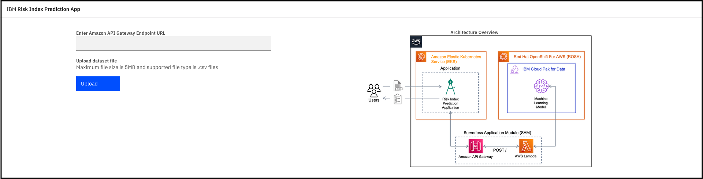

# Risk Index Prediction Application

The Risk Index Prediction application uses the following:
- Frontend: ReactJS
- Backend: Nginx

You need to enter the Amazon API Gateway Endpoint URL for the Lambda function.
You can upload a dataset with n rows of data and get the risk index prediction along with probability.
You can then analyse the risk index predictions and probability along with the scoring data in a table format.

## Run React Application Locally

### Step 1: Install Yarn package manager

```bash
npm install --global yarn
```

### Step 2: Install the app dependencies

```bash
yarn install
```

### Step 3: Run the React Application

```bash
yarn start
```



## Deployment Script

Use this deployment script to create a deployment and service on any Kubernetes cluster.
- [deploy.yaml](deploy.yaml)

```bash
kubectl apply -f deploy.yaml
```

## Build Container Image

Use this dockerfile to build a container image for the application.
- [Dockerfile](Dockerfile)

```bash
docker build -t ri-predict-app:v1.0 .
```